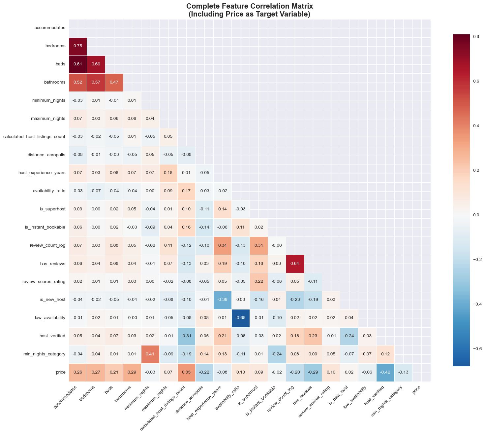
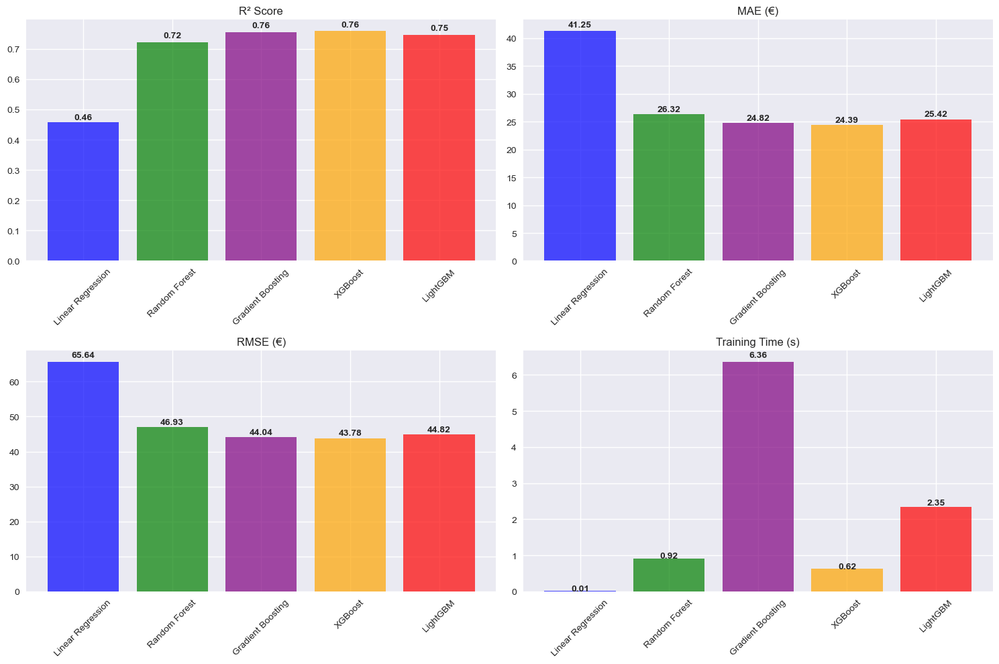
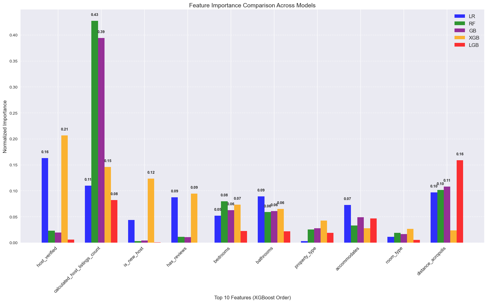

# Short-term Rentals Price Prediction

A comprehensive machine learning study for predicting short-term rental prices in Athens, Greece, featuring advanced feature engineering, ML-model training and comparison, and deployment through an interactive Streamlit application.
**[Try on Streamlit Cloud](https://price-prediction-athens-airbnb.streamlit.app/)**
 
## Table of Contents
1. **[ Dataset](#dataset)** 
2. **[ Data Cleaning](#data-cleaning)** 
3. **[ Feature Engineering](#feature-engineering)** 
4. **[ Feature Selection & Model Preprocessing](#feature-selection--model-preprocessing)**
5. **[ Model Comparison](#model-training)** 
6. **[ Top Features](#top-performing-features)** 
7. **[ Key Business insights](#key-business-insights)**
8. **[ How to Use](#how-to-use)**  
9. **[ Project Structure](#project-structure)** 
10. **[ Future Improvements](#future-improvements)** 
11. **[ Limitations](#limitations)**

## Dataset
This dataset contains listings web-scraped from airbnb through an open-source project called Inside.Airbnb.
- **Source**: https://insideairbnb.com/ 
- **Size**: 15,000+ listings
- **Features**: Property characteristics, host information, location data, review metrics
- **Target**: Nightly rental price (EUR)

## Data Cleaning

- **Price Column:** - Removed currency sign
- **Outlier Removal:** - Conservative approach using 0.5% and 99.5% quantiles for price filtering
- **Propery Type Column:** - Cleaned similar names and removed types that appear rarely

## Feature Engineering

- **Location Features**: Distance to Acropolis using manhattan calculation, neighborhood encoding
- **Property Efficiency**: Room density, space utilization ratios
- **Host Quality**: Experience, superhost status, verification metrics  
- **Review Patterns**: Rating scores, review frequency and recency
- **Booking Dynamics**: Availability patterns, booking flexibility

**Distance from Acropolis shows significant price correlation**


## Feature Selection & Model Preprocessing

### **Feature Selection**
After extensive feature engineering, the final model uses **26 key features** that demonstrated the highest predictive power:

**Numerical Features (19):**
- `accommodates`, `bedrooms`, `beds`, `bathrooms`, `minimum_nights`, `maximum_nights`
- `calculated_host_listings_count`, `distance_acropolis`
- `host_experience_years` ,`availability_ratio`, `is_superhost`, `is_instant_bookable`
- `review_count_log`, `has_reviews`, `review_scores_rating`
- `is_new_host`, `low_availability`, `host_verified`, `min_nights_category`

**Categorical Features (3):**
- `property_type`, `room_type`, `neighbourhood_cleansed`

**Feature Correlation Matrix** (including price)


### **Data Preprocessing**

**Missing Value Imputation Strategy:**
- **Numerical features**: Median imputation for robust handling
- **Categorical features**: Fill Null with "Unknown" category
- **Review features**: Fill 0 for new listings without reviews

**Feature Scaling:**
- **StandardScaler** applied to all numerical features
- Ensures equal weight across features with different scales
- Critical for XGBoost, not needed for LightGBM

**Categorical Encoding:**
- **Label Encoding** for ordinal categorical variables
- **Top-20 category preservation** for high-cardinality features (neighborhoods)
- Rare categories grouped into "Other" to prevent overfitting

**Train/Test Split:**
- **80/20 split** with stratified sampling by neighborhood
- **Random state fixed** for reproducible results

## Model Training
**In the jupyter notebook I trained five different machine learning models to see which performs better using R², RMSE, MAE, Training Time as model evaluation metrics**

| Model | R² Score | RMSE (€) | MAE (€) | Training Time (s) |
|-------|----------|----------|---------|-------------------|
| XGBoost | 75.8% | €43.78 | €24.39 | **0.61** |
| Gradient Boosting | 75.5% | €44.03 | €24.81 | **6.18** |
| LightGBM | 74.8% | €44.67 | €25.37 | 0.96 |
| Random Forest | 72.2% | €46.94 | €26.31 | 0.81 |
| Linear Regression | 45.7% | €65.64 | €41.26 | 0.01 |



XGBoost and Gradient Boosting perform almost identically, sometimes scoring slightly different because of the random training sample scale.
The biggest advantage of XGBoost is the significant faster training time.

## Top Performing Features



Based on feature importance analysis across all five models, here are the key insights from Athens Airbnb pricing patterns:

### **Most Critical Features**

**1. Host Credibility & Portfolio (Dominant Factors)**
- **`host_verified`** (22% importance in XGBoost): Identity verification is the single most important pricing factor
- **`calculated_host_listings_count`** (43% in Random Forest, 15% in XGBoost): Professional hosts with multiple properties command significantly higher prices

**2. Property Fundamentals (Core Drivers)**
- **`bedrooms`** (8-10% across models): Primary determinant of accommodation capacity
- **`bathrooms`** (5-8% across models): Essential amenity that directly impacts pricing
- **`accommodates`** (3-4% across models): Guest capacity baseline for price calculation

**3. Location Intelligence (Consistent Predictor)**
- **`distance_acropolis`** (10% in Random Forest, 2% in XGBoost): Proximity to Athens' main attraction

**4. Host Experience & Quality**
- **`host_experience_years`** (4% importance): Seasoned hosts optimize pricing better
- **`review_scores_rating`** (3% importance): High ratings enable premium pricing
- **`review_count_log`** (2-3% importance): Review volume builds pricing confidence

**5. Property Management Strategy**
- **`availability_ratio`** (3-4% importance): Strategic availability management affects pricing
- **`property_type`** (3-5% importance): Property classification impacts market positioning

Features that appear as top-10 across multiple models:
- `calculated_host_listings_count` (universal top-3)
- `bedrooms` & `bathrooms` (consistent across all models)  
- `distance_acropolis` (top-10 in 4/5 models)
This cross-model agreement validates these features as truly fundamental to short-term rental pricing dynamics.

## **Key Business Insights**

**Trust Beats Everything**: Host verification and professional portfolio size outweigh property characteristics in pricing power. A verified host appears more trusted to the customer.

**Location Pays**: The engineered distance-to-Acropolis feature proves location premium is quantifiable. Properties within walking distance of major attractions command measurable premiums.

**Experience Premium**: Hosts with years of experience and high review scores can optimize pricing strategies that newer hosts cannot match.

**Professional vs Amateur Gap**: The importance of `calculated_host_listings_count` reveals a significant pricing gap between occasional hosts (1-2 listings) and professional operators (5+ listings), probably due to more premium offerings and amenities

## How to Use

### **Live Web Application** 
 **[Try the app on Streamlit Cloud](https://price-prediction-athens-airbnb.streamlit.app/)**

### **Try Locally**

**Install Requirements**
```bash
pip install -r requirements.txt
```
```bash
streamlit run Athens_Price_Prediction_Streamlit.py
```

### **Research Notebook**
Explore the full model development process:
```bash
jupyter notebook Notebook/model_pipeline_notebook.ipynb
```

### **Command Line Sample Prediction**
```bash
python model/predict_my_listing_price.py
```

### **Model Training**
Retrain with updated data:
```bash
python model/airbnb_price_predictor.py
```

## Project Structure

```
Athens-Airbnb-Price-Prediction/
├── Notebook/
│   └── model_pipeline_notebook.ipynb    # Complete research workflow
├── model/
│   ├── airbnb_price_predictor.py        # Core ML pipeline
│   └── predict_my_listing_price.py      # CLI interface
├── data/
│   ├── athens_listings.csv              # Training dataset
│   └── city-5761429_1920.jpg           # UI background
├── Athens_Price_Prediction_Streamlit.py # Web application
├── model.pkl                           # Trained model 
├── requirements.txt                    # Dependencies
└── README.md                          
```


## Future Improvements

1. **Temporal Analysis**: Seasonal pricing patterns and demand forecasting
2. **Deep Learning**: Neural network architectures for complex feature interactions
3. **Multi-City Models**: Generalization across different cities
4. **Dynamic Pricing**: Real-time price optimization algorithms
5. **External Factors**: Integration of events, weather, and economic indicators

## Limitations

**The dataset provided by inside.airbnb contains listings only near the center of Athens, suburb areas are not included so the prediction of these neighboorhoods will not be accurate**


