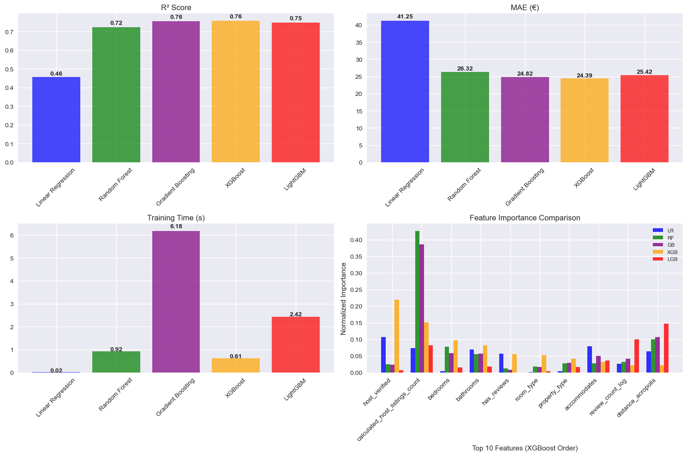

# Athens Airbnb Price Prediction Research

A comprehensive machine learning study for predicting Airbnb prices in Athens, Greece, featuring advanced feature engineering, model comparison, and deployment through an interactive Streamlit application.

### Table of Contents
1. **[ Dataset](#dataset)** - Data source
2. **[ Data Processing](#data-processing)** 
3. **[ Feature Engineering](#feature-engineering)** 
4. **[ Model Comparison](#model-comparison)** 
5. **[ Key Insights](#key-insights)** 
6. **[ Interactive Web Application](#interactive-web-application)** 
7. **[ How to Use](#how-to-use)**  
8. **[ Project Structure](#project-structure)** 
9. **[ Future Improvements](#future-improvements)** 

## Dataset
- **Source**: https://insideairbnb.com/ 
- **Size**: 15,000+ listings
- **Features**: Property characteristics, host information, location data, review metrics
- **Target**: Nightly rental price (EUR)

## Data Processing
Cleaned price column, removed outliers, fixed property type text issues and more dataset refinement

## Feature Engineering
The engineered features had a significant impact on model performance

- **Location Features**: Distance to Acropolis using manhattan calculation, neighborhood encoding
- **Property Efficiency**: Room density, space utilization ratios
- **Host Quality**: Experience, superhost status, verification metrics  
- **Review Patterns**: Rating scores, review frequency and recency
- **Booking Dynamics**: Availability patterns, booking flexibility

## Model Comparison
**In the notebook I compared different machine learning models to see which performs better:**

| Model | R² Score | RMSE (€) | MAE (€) |
|-------|----------|----------|---------|
| **XGBoost** | **76.0%** | **€43.65** | **€24.28** |
| LightGBM | 75.9% | €44.08 | €24.90 |
| Gradient Boosting | 75.5% | €44.08 | €24.90 |
| Random Forest | 72.2% | €46.95 | €26.30 |
| Linear Regression | 61.6% | €55.16 | €35.64 |



**Model Interpretation:**
- Explains 76% of price variance
- Average prediction error: €24.28 per night
- Strong performance across all property types and neighborhoods

## Key Insights

1. **Location Impact**: Distance to major attractions (Acropolis) shows strong predictive power
2. **Host Quality**: Superhost status and experience significantly affect pricing
3. **Property Efficiency**: Room density and space efficiency are crucial factors
4. **Review Patterns**: Both quantity and quality of reviews impact pricing decisions
5. **Booking Flexibility**: Instant booking and minimum night requirements affect price optimization


## Interactive Web Application

The model is deployed through a user-friendly Streamlit interface featuring:

### **Core Features**
- **Interactive Map**: Click-to-select property location in Athens
- **Real-time Predictions**: Instant price estimates based on input parameters
- **Model Transparency**: Display of actual performance metrics

### **Technical Implementation**
- **Frontend**: Streamlit with custom CSS styling
- **Backend**: Scikit-learn pipeline with XGBoost
- **Deployment**: Streamlit Cloud

## How to Use

### **Install Requirements**
```bash
pip install -r requirements.txt
```
### **Live Web Application** 
 **[Try the Live Demo on Streamlit Cloud](https://your-app-url.streamlit.app)**

### **Try Locally**
```bash
streamlit run Athens_Price_Prediction_Streamlit.py
```

### **Research Notebook**
Explore the full model development process:
```bash
jupyter notebook Notebook/model_pipeline_notebook.ipynb
```

### **Command Line Sample Prediction**
```bash
python model/predict_my_listing_price.py
```

### **Model Training**
Retrain with updated data:
```bash
python model/airbnb_price_predictor.py
```

## Project Structure

```
Athens-Airbnb-Price-Prediction/
├── Notebook/
│   └── model_pipeline_notebook.ipynb    # Complete research workflow
├── model/
│   ├── airbnb_price_predictor.py        # Core ML pipeline
│   └── predict_my_listing_price.py      # CLI interface
├── data/
│   ├── athens_listings.csv              # Training dataset
│   └── city-5761429_1920.jpg           # UI background
├── Athens_Price_Prediction_Streamlit.py # Web application
├── model.pkl                           # Trained model 
├── requirements.txt                    # Dependencies
└── README.md                          
```


## Future Improvements

1. **Temporal Analysis**: Seasonal pricing patterns and demand forecasting
2. **Deep Learning**: Neural network architectures for complex feature interactions
3. **Multi-City Models**: Generalization across different European cities
4. **Dynamic Pricing**: Real-time price optimization algorithms
5. **External Factors**: Integration of events, weather, and economic indicators


